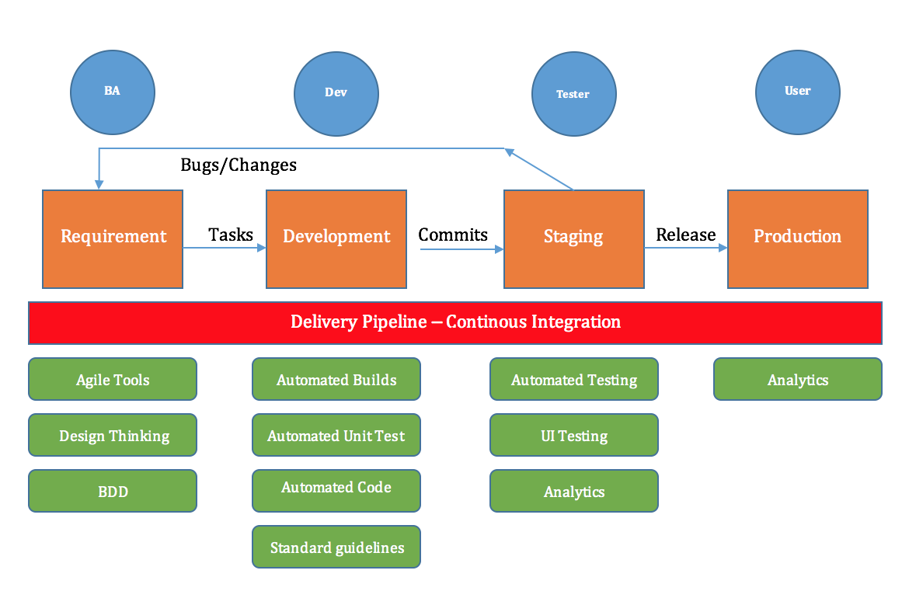
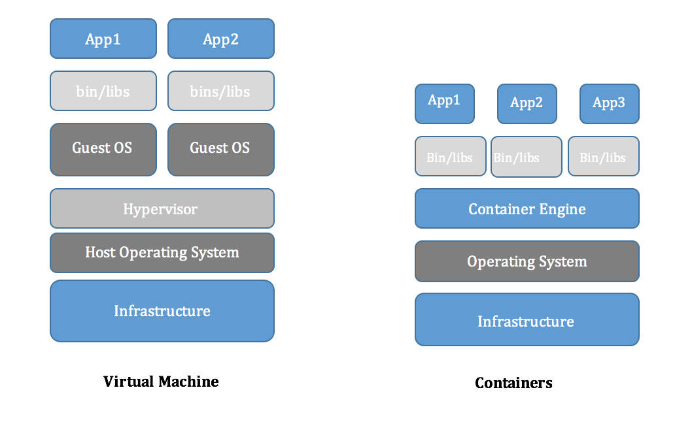
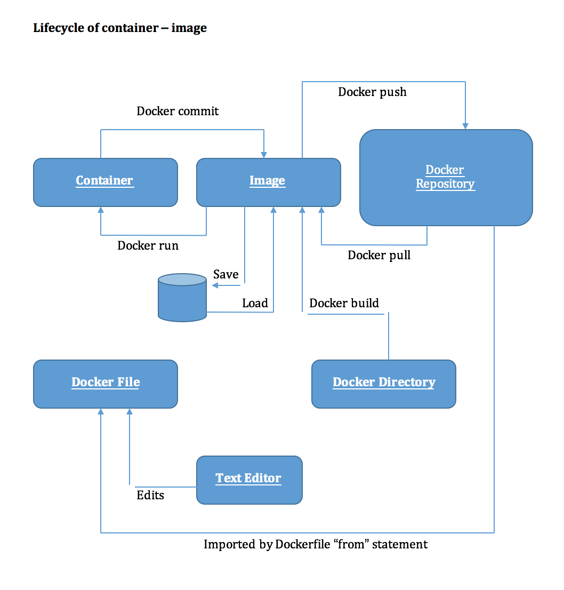
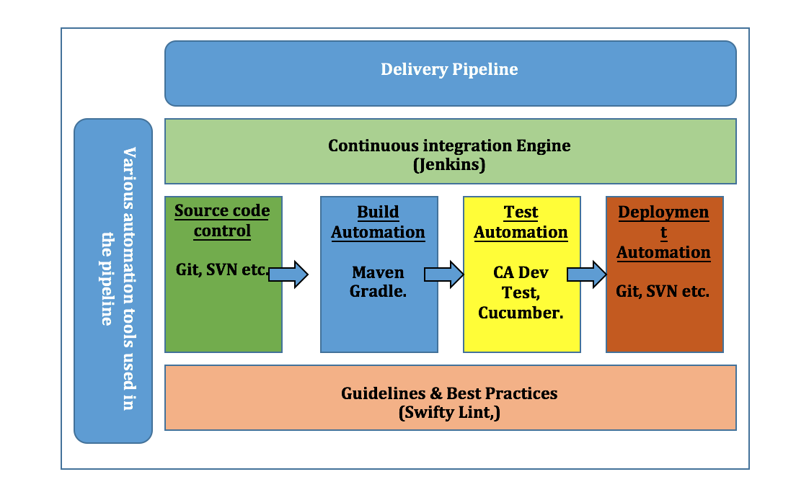

**IBM-10/3/2017**

**PROPOSAL**

Plan to Streamline the Software Development process.

I. Summary 

II. Needs & Problems 

III. Introduction to Proposed Options

IV. Goals/Objectives

V. Timetable

VI. Exercise

VII. Next Steps

VIII. Appendix

# I.Summary

This document intends to highlight current challenges faced by the IBM
studios in ramping up new internal software development efforts from the
time of its inception to go-live and propose a plan which will help
overcome these challenges by leveraging standard tools and technique
currently available to us in the form of Bluemix environment, its
services and other open source options.

The goal is also to bring all the iX studio under one umbrella of
standard procedures and practices.

There is a strong need to start conversation and collaboration among iX
studios to identify best practices and tools that has worked in the
past, refine them and make them as the standards for future
developments.

**Some of the core areas that we are trying to focus includes but not
limited to;**

* Setup and availability of development / staging environment to the
    developers in time.

* Lack of transparency on knowledge base, assets/reusable code that
    can be shared between studios.

* Need for common set of iX standard practices, guidelines & tools for
    development.

* Maintaining high quality code standards is a challenge, costing IBM
    time, money and customers.

* Plan for solid delivery pipeline with tried and tested tools.

* Need for Automated Continuous integration & Testing.

* Utilize readily available API services (Watson, Weather etc.)
    currently offered by Bluemix to add value proposition to our fast
    paced customer pitches/prototypes.

# II.Needs & Problems

1.  Quick setup and availability of development / staging environment to
    the developers.

    Currently lot of time is spent in deciding and coming up with a
    development environment and its configurations. This is a repetitive
    task at the beginning of every project. Many time had to go thru lot
    of approval and sign offs.

    * Need is to have a dedicated development environment which can be
    readily used by the any iX practitioners using their IBM id.

    * We should use Virtual Machines and Docker-Container architecture to
    spin-up environment as and when needed. These services are available
    to us in the form of catalog services in Bluemix.

    * We should maintain a library of pre-configured images of containers
    depending on the technology stack. Docker-container images can be
    easily setup, maintained and deployed using commit.

2.  Lack of transparency on knowledge base, assets/reusable code that
    can be shared between studios.

    For the studios and iX practitioner to collaborate well and utilize
    existing assets we need to have a common pool of knowledge and
    assets.

    * This will reduce development time. If something is already
    developed, tried and tested for a past sales pitch, it can be reused
    for another.

    * Developers can develop and share custom controls.

    * Techniques used in other projects that has solved problems and help
    gain customer confident can also be shared across to showcase our
    achievements.

3.  Need for common set of iX standard practices, guidelines & tools for
    development.

    Currently there is are no common set of guidelines & tools across
    studios.

    * Having a common set of standards will allow our practitioner to
    adapt quickly when working of assignments from other studios.

    * Share reusable code easily.

    * Have a one IBM approach when facing customers.

4.  Maintaining high quality code standards is a challenge, costing IBM
    time, money and customers.

    * Leverage open source tools like Swift Lint and others to
    automatically guide and implemented code quality standard.

    * Each project scope should have usage of such tools as a
    requirement.

5.  Need for a solid delivery pipeline with tried and tested tools.

    * In an Agile development it is important to have well integrated
    tool chain which will stream line the development effort from
    requirements to release.

    * All studio should follow a blueprint of this pipeline having trial
    and tested tools as the standards.
    
    

6.  Need for Automated Continuous integration & Testing to be integral
    part of our software development efforts.

7.  Identify and utilize readily available API services (Watson, Weather
    etc.) currently offered by Bluemix to add value proposition to our
    fast paced customer pitches/prototypes.

# III.Introduction to Proposed Options

## 1.BlueMix

As we all know, IBM Bluemix is a cloud platform as a service (PaaS)
developed by IBM. It supports several programming languages and
services \[1\] as well as integrated DevOps to build, run, deploy and
manage applications on the cloud. Bluemix is based on Cloud Foundry
open technology and runs on SoftLayer infrastructure. Bluemix supports
several programming languages \[2\] including Java, Node.js, Go, PHP,
Swift, Python, Ruby Sinatra, Ruby on Rails and can be extended to
support other languages such as Scala \[3\] through the use of build
packs

Some of the services that BlueMix currently offers are introduced
below.

## 2.Virtual Machines

Containers and virtual machines are two ways to deploy multiple,
isolated services on a single platform.

## 3.Docker -Containers

Docker provides the ability to package and run an application in a
loosely isolated environment called a container. The isolation and
security allow you to run many containers simultaneously on a given
host. Containers are lightweight because they don't need the extra
load of a hypervisor, but run directly within the host machine's
kernel. This means you can run more containers on a given hardware
combination than if you were using virtual machines. You can even run
Docker containers within host machines that are actually virtual
machines!
 
A container image is a lightweight, stand-alone, executable package of
a piece of software that includes everything needed to run it: code,
runtime, system tools, system libraries, settings. Available for both
Linux and Windows based apps, containerized software will always run
the same, regardless of the environment. Containers isolate software
from its surroundings, for example differences between development and
staging environments and help reduce conflicts between teams running
different software on the same infrastructure.

Containers are an abstraction at the app layer that packages code and
dependencies together. Multiple containers can run on the same machine
and share the OS kernel with other containers, each running as
isolated processes in user space. Containers take up less space than
VMs (container images are typically tens of MBs in size), and start
almost instantly

Containers and virtual machines have similar resource isolation and
allocation benefits, but function differently because containers
virtualize the operating system instead of hardware, containers are
more portable and efficient.

The use of Virtual Machines or Containers will help eliminate the
latency to bring up and setup the environment needed for fast
development and release. Images can be used to store the snapshot of a
particular environment, or delivery workflow which can then be re-used
to create similar environment for different projects.

Docker streamlines the development lifecycle by allowing developers to
work in standardized environments using local containers which provide
your applications and services. Containers are great for continuous
integration and continuous development (CI/CD) workflows.

## 4.Dev Ops - Delivery Pipeline Automation

DevOps is the effort to improve communication and synergies between
development organizations and operations organizations---hence the term,
"DevOps." The main focus is to improve the efficiency, quality and speed
to market within the software development world.

The delivery pipeline can be broken down into a few major buckets of
work, or stages, as mentioned below.

1.  Source Code Control (Management)

2.  Build Automation

3.  Test Automation.

4.  Deployment Automation

5.  Monitoring (not in scope)

We all know what a typical delivery pipeline looks like, just to
highlight some of the stages with the tools often used here is high
level picture:

**[Every Project should have following as their standard
implementation:]**

### A.Source Code Control (Management)

Source code management, or source code control, certainly is not a new topic. This has been around for decades and has evolved over time. In a nutshell, an organization stores its code in a source code control system or repository so it can be tracked, maintained, versioned and audited. Developers should not store the code on their laptops or virtual machines and trust that will suffice for managing the code. {#source-code-management-or-source-code-control-certainly-is-not-a-new-topic.-this-has-been-around-for-decades-and-has-evolved-over-time.-in-a-nutshell-an-organization-stores-its-code-in-a-source-code-control-system-or-repository-so-it-can-be-tracked-maintained-versioned-and-audited.-developers-should-not-store-the-code-on-their-laptops-or-virtual-machines-and-trust-that-will-suffice-for-managing-the-code. .ListParagraph}

#### Possible Tools

>[Git](https://git-scm.com/) is probably the most widely used SCM
system out there. It is an open-source system.

>[Subversion (SVN)](https://subversion.apache.org/) has been around for
quite some time. It is also an open-source system and is heavily used
in many organizations, but there has been more of a push toward Git.

>Git and Subversion comparison can be
found [here](https://git.wiki.kernel.org/index.php/GitSvnComparison).

### B.Build Automation

Once a source code management system is in place and actively being used by a development team, the team will need to be able to compile and build their code. This is probably the first step in the whole chain of continuous integration events---it's what gets the ball rolling. The code needs to build cleanly before an organization can even think about deploying out to its environments for testing and production. {#once-a-source-code-management-system-is-in-place-and-actively-being-used-by-a-development-team-the-team-will-need-to-be-able-to-compile-and-build-their-code.-this-is-probably-the-first-step-in-the-whole-chain-of-continuous-integration-eventsits-what-gets-the-ball-rolling.-the-code-needs-to-build-cleanly-before-an-organization-can-even-think-about-deploying-out-to-its-environments-for-testing-and-production. .ListParagraph}

#### Possible Tools

>[Gradle](https://gradle.org/) is an open-source build automation
system used by top companies including Netflix, Google and LinkedIn.

>[Maven](https://maven.apache.org/) is another open-source build
automation system.

>Gradle and Maven comparison can be
found [here](https://gradle.org/maven_vs_gradle/) and [here](http://devops.com/2015/03/27/puzzle-gradle-maven/).

### C.Unit Test Automation

Developers should be running unit tests on their code to ensure the functionality they are building works as expected. In an ideal world, the development team should be saving these unit tests so they can be reused and put into a regression test bed. {#developers-should-be-running-unit-tests-on-their-code-to-ensure-the-functionality-they-are-building-works-as-expected.-in-an-ideal-world-the-development-team-should-be-saving-these-unit-tests-so-they-can-be-reused-and-put-into-a-regression-test-bed. .ListParagraph}

#### Possible Tools

>There are multiple tools out there for helping developer unit test
their code. Many of these tools are open-source and can be used
freely.

>[JUnit ](http://junit.org/junit4/)is an open-source unit test
framework pretty widely used.

>[CA DevTest](https://docops.ca.com/devtest-solutions/8-0/en/) allows
for the automation of unit testing, as well as a few other bells and
whistles, such as service virtualization.

>[Cucumber](https://cucumber.io/docs) is a software tool used by
computer programmers for testing other software.\[7\] It runs
automated acceptance tests written in a behavior-driven development
(BDD) style.\[8\] Central to the Cucumber BDD approach is its plain
language parser called Gherkin. It allows expected software behaviors
to be specified in a logical language that customers can understand.
As such, Cucumber allows the execution of feature documentation
written in business-facing text.\[9\] Capybara, which is a part of the
Cucumber testing framework,\[10\] is an example of a web based test
automation software.

### D.Deployment Automation

For the last stage in the process, delivery teams need to deploy their code/applications out to various test environments and, of course, production. To reduce errors and overhead in the deployment process, while increasing speed to market, this step can be automated through a variety of tools and methods. {#for-the-last-stage-in-the-process-delivery-teams-need-to-deploy-their-codeapplications-out-to-various-test-environments-and-of-course-production.-to-reduce-errors-and-overhead-in-the-deployment-process-while-increasing-speed-to-market-this-step-can-be-automated-through-a-variety-of-tools-and-methods. .ListParagraph}

#### Possible Tools

>[IBM Urban code
uDeploy](http://www-03.ibm.com/software/products/en/ucdep) allows
users to model a process and orchestrate their deployment. This
process then can be repeated across all an organization's
environments, and tweaked for each environment as needed.

>[Ansible](http://www.ansible.com/) is an open-source IT automation
tool. It can be used for everything from configuration management to
product installation to application deployments. This tool is rapidly
gaining acceptance and momentum in the DevOps community.

## Bluemix Value added services:

Bluemix offers various value added services some of which are
mentioned below. These services are easy to deploy using the simple
SDK approach in your app or can be readily configured and accessed
through an API setup.

### 1.Push Notification

>The Push Notifications service provides a unified push service to send
>real-time notifications to mobile and web applications. The service
>provides the ability to personalize and send notifications to a
>segment of users, single user or broadcast to all users.

### 2.Mobile Analytics

>Mobile app developers and business stakeholders: Use IBM Mobile
>Analytics for Bluemix to gain insight into how your app is performing
>and how it is being used. Monitor performance and usage of all your
>applications from your desktop or tablet without creating queries or
>engaging a data analyst. Quickly identify trends and anomalies, drill
>down to resolve issues, and trigger alerts when key metrics cross
>critical thresholds. Report data directly from your app or connect
>through Mobile Foundation server.

### 3.Zuznow.

>Automatic front-end development platform to rapidly develop a premium
>omni-channel presence. Leverage Zuznow to create secure mobile web and
>mobile apps.

### 4.Watson API

>#### A.Conversation

>Add a natural language interface to your application to automate
>interactions with your end users. Common applications include virtual
>agents and chat bots that can integrate and communicate on any channel
>or device. Train Watson Conversation service through an easy-to-use
>web application, designed so you can quickly build natural
>conversation flows between your apps and users, and deploy scalable,
>cost effective solutions.

>#### B.SpeechToText

>The Speech to Text service converts the human voice into the written
word. It can be used anywhere there is a need to bridge the gap
between the spoken word and their written form, including voice
control of embedded systems, transcription of meetings and conference
calls, and dictation of email and notes. This easy-to-use service uses
machine intelligence to combine information about grammar and language
structure with knowledge of the composition of the audio signal to
generate an accurate transcription. The following languages and
features are currently 

#### C.Personality Insights

Watson Personality Insights: Personality Insights derives insights
from transactional and social media data to identify psychological
traits which determine purchase decisions, intent and behavioral
traits; utilized to improve conversion rates.

# IV.Goals/Objectives

1)  Utilization of Virtual machine or Container architecture to image
    and reuse configurations to bring up development environment
    quickly.

2)  Plan for a solid well integrated delivery pipeline made up of tools
    which are tried and tested in past projects.

3)  Incorporate open source tool to streamline development efforts and
    keep check on code quality. Eg. Swift lint for iOS, Danger etc.

4)  Create a pool of sample project, reusable code or libraries which

5)  Standardize & maintain frameworks such as MobileFirst iOS
    Accelerator, for rapid development.

# V.Timetable

>Provide detailed information on the expected timetable for the project.
>Break the project into phases, and provide a schedule for each phase.
 
  **Phase One**
  Collaborate and identify problem areas across studios in detail.
  **Phase Two**     
  Gather information on approaches and tools used to solve problem in past.
  **Phase Three**   
  Plan to create a local end to end implementation.
                                                                                                

# VI.Exercise

1)  Develop a studio wide practice and have all the past code base setup
    under one Git server.

2)  Consolidate and refine current standards in one structure.

3)  Gather pain points talking to people from different studios/project
    on how they have done things in the past.

4)  Fine and research on libraries available internally and plan on how
    to maintain and utilize them. (MobileFirst iOS Accelerators)

5)  Try to develop a sample project locally with an integrated toolchain
    on the Docker-container and learn on how to update and port it to
    other machines.

# VII.Next Steps

1)  Meet with other iX studio lead and offer them to start working on
    this strategy collectively.

2)  Have periodic collaboration among Sr. Leads across iX Studios to
    discuss and share their experience of past projects and thus come up
    with solution and guidelines to overcome those in future.

# VIII.Appendix

Provide supporting material for your proposal here. It may be:

+   BlueMix

    <https://console.bluemix.net>

+   Research materials

    <https://medium.com/@cherrmann.com/continuous-integration-and-delivery-for-ios-with-jenkins-and-fastlane-part-1-3b17f1901a73>

    <https://docs.docker.com/get-started/#prerequisites>

    <https://docs.docker.com/engine/docker-overview/#control-groups>

    <https://w3-connections.ibm.com/wikis/home?lang=en-us#!/wiki/Wc3aab0793d4f_4381_b44d_c96facd32ab9/page/Welcome%20to%20MobileFirst%20iOS%20Accelerators>

    <https://blog.netapp.com/blogs/containers-vs-vms/>
    
     MobileFirst iOS Accelerators (Used by Apple+IBM teams in Atlanta)
